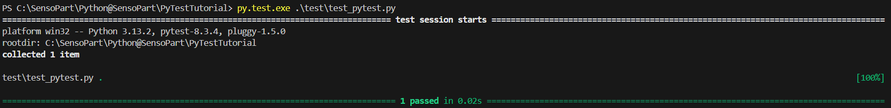
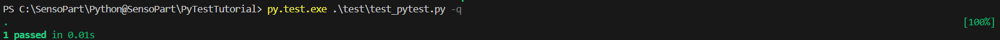
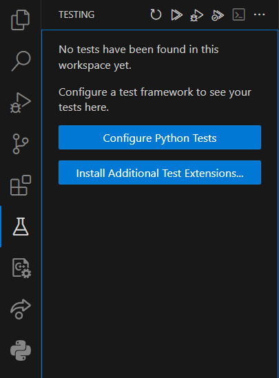
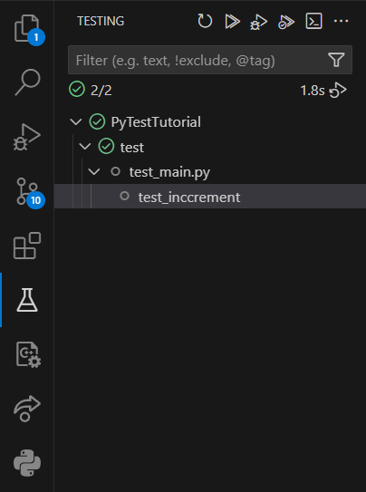

# PyTestTutorial
Demonstrates how to use PyTest

## Repository
This repository has three main folders: `src/`, `config/` and `test/`

### `src/`
Here is python source code with production code and functionality 

### `data/`
Here are all data files to used in the project, e.g. images

### `test/`
Here you find files which hold tests cases which should test the production code


## Install PyTest


1. Run the following command in your Windows powershell:
```bash
# Basic installation
$ pip install -U pytest
```

2. Check that you installed the correct version 
```bash
$ pytest --version
pytest 8.3.4
```

## Create your first test
See the function `increment(x)` in the source file `./src/main.py`.
```python
def increment(x):
    return x + 1
```

In the file `./test/test_pytest.py` there is the associated test:
```python
def test_inccrement():
    assert inc(3) == 4
```

Run the test by running the following command in you Windows powershell:
```bash
$ py.test.exe .\test\test_pytest.py
```


Run the quite version with the flag `-q`
```bash
$ py.test.exe .\test\test_pytest.py -q
```



## Run Tests 

Here I show 2 ways how to run the defined tests in `./test/`

### Via powershell command line
Run the test by running the following command in you Windows powershell:
```bash
$ py.test.exe .\test\test_pytest.py
```

## With the VSCode tesing extension


1. Press `Configure Python Tests` and select PyTest and the `test/` folder as test directory
2. add empty `__init__.py` into `./test/`
3. Refresh and run all tests in the testing tab

